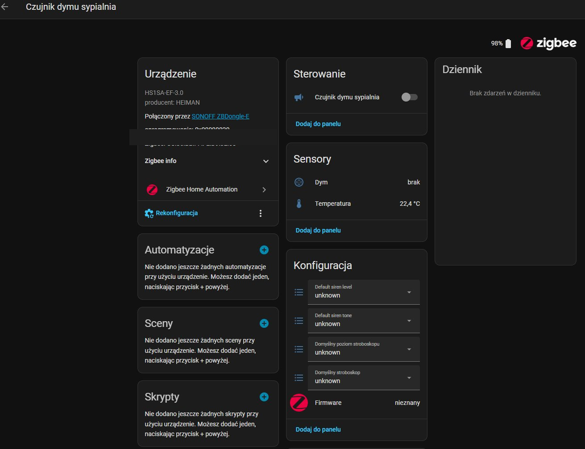
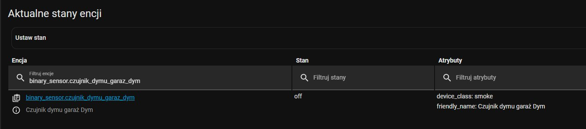
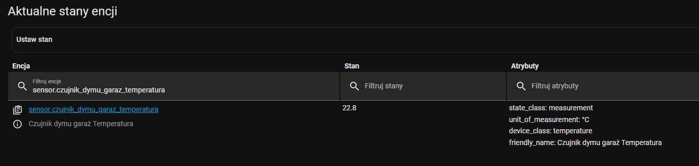
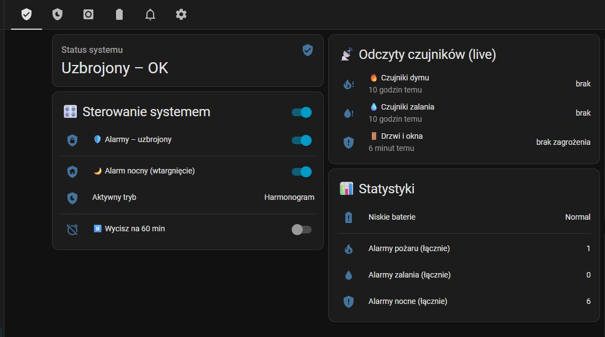

# HEIMAN HS1SA-EF-3.0 Smoke Detector — Full Home Assistant Implementation

A complete, production-ready Home Assistant integration for the **HEIMAN HS1SA-EF-3.0** Zigbee smoke detector. This repository documents a real-world multi-sensor deployment with fire alarm automation, battery monitoring, automatic appliance shutoff, and mobile push notifications with deep-link navigation.

---

## 🛒 Hardware

| Property | Value |
|---|---|
| Manufacturer | HEIMAN |
| Model | **HS1SA-EF-3.0** |
| Protocol | Zigbee (ZHA, no custom quirk needed) |
| Firmware tested | `0x00000020` |
| Zigbee coordinator tested | SONOFF ZBDongle-E |
| Power | CR123A battery |
| Built-in sensors | Smoke (photoelectric) + Temperature |
| Built-in siren | Yes — HA-controllable |

> **Pairing:** Standard Zigbee pairing. Hold the test button until the LED flashes, then add via ZHA. Works out of the box — **no custom quirk files needed.**

---

## 📦 Entities Exposed (per device)

ZHA automatically creates **12 entities** for each HS1SA-EF-3.0:

| Entity | Type | Description |
|---|---|---|
| `binary_sensor.*_dym` | `smoke` | Main smoke detection |
| `sensor.*_temperatura` | `temperature` | Ambient temperature (°C) |
| `sensor.*_bateria` | `battery` | Battery level (%) + voltage attribute |
| `siren.*` | `siren` | Built-in alarm siren (HA-controllable) |
| `select.*_default_siren_tone` | `select` | Siren sound type |
| `select.*_default_siren_level` | `select` | Siren volume (`Very high level sound`, etc.) |
| `select.*_domyslny_stroboskop` | `select` | Strobe mode |
| `select.*_domyslny_poziom_stroboskopu` | `select` | Strobe intensity |
| `button.*_zidentyfikuj` | `button` | Identify (blinks LED) |
| `update.*_firmware` | `update` | OTA firmware updates via ZHA |
| `sensor.*_lqi` | `sensor` | Zigbee link quality |
| `sensor.*_rssi` | `sensor` | Zigbee signal strength |

### Device page in Home Assistant

This is what the device page looks like after pairing — all sensors and configuration options visible immediately, no extra setup required:



> **Note:** The `Default siren level`, `Default siren tone`, and strobe controls may show `unknown` until the device sends its first configuration report. This is normal — the sensor still operates correctly.

### Entities in Developer Tools → States

Smoke binary sensor (`device_class: smoke`, state `off` = clear):



Temperature sensor with full attributes (`state_class: measurement`, `device_class: temperature`):



### Example entity IDs (rename to your preference after pairing):

```yaml
# Garage sensor (renamed after pairing)
binary_sensor.czujnik_dymu_garaz_dym
sensor.czujnik_dymu_garaz_temperatura
sensor.czujnik_dymu_garaz_bateria
siren.czujnik_dymu_garaz

# Bedroom sensor (entity_id kept at ZHA default — rename anytime in Settings → Devices)
binary_sensor.heiman_hs1sa_ef_3_0_dym
sensor.heiman_hs1sa_ef_3_0_temperatura
sensor.heiman_hs1sa_ef_3_0_bateria
siren.heiman_hs1sa_ef_3_0
```

---

## 🏗️ Architecture Overview

This implementation uses a **packages-based** HA architecture. Everything lives in a single YAML package file (`ems_security.yaml`) which is included via:

```yaml
# configuration.yaml
homeassistant:
  packages: !include_dir_named packages/
```

The design follows a **three-layer logic**:

```
Physical sensors (ZHA)
        ↓
Template binary_sensor (alarm_pozar) — aggregates all smoke sensors
        ↓
Automation layer — reacts to alarm_pozar state changes
```

This means adding a new sensor in the future only requires editing the template, not every automation.

---

## ⚙️ Configuration

### 1. Group Template Sensor — Aggregating Multiple Smoke Detectors

This template binary sensor combines smoke detectors from all rooms into a single alarm point. It also provides a human-readable attribute listing which specific sensors are active — used directly in notification messages.

```yaml
template:
  - binary_sensor:

      - name: "alarm_pozar"
        unique_id: alarm_pozar
        device_class: smoke
        icon: mdi:fire-alert
        state: >
          {{ is_state('binary_sensor.czujnik_dymu_garaz_dym', 'on')
             or is_state('binary_sensor.czujnik_dymu_biuro_dym', 'on')
             or is_state('binary_sensor.czujnik_dymu_kuchnia_dym', 'on')
             or is_state('binary_sensor.heiman_hs1sa_ef_3_0_dym', 'on') }}
        attributes:
          active_sensors: >
            
            
              
            
            
              
            
            
              
            
            
              
            
            {{ lista | join(', ') if lista else 'None' }}
```

> **Why a group sensor?** Automations trigger on a single `binary_sensor.alarm_pozar` — a unified point of truth. Adding more detectors only requires editing the template, not every automation.

---

### 2. Control Switches (input_boolean)

```yaml
input_boolean:

  alarm_system_armed:
    name: "Alarm system – armed"
    icon: mdi:shield-lock
    initial: true          # system is armed on HA restart

  alarm_mute_60min:
    name: "Alarm – mute for 60 min"
    icon: mdi:alarm-off
    initial: false

  alarm_fire_active:
    name: "FIRE ALARM – active"
    icon: mdi:fire-alert
    initial: false
```

---

### 3. Battery Threshold (input_number)

Configurable threshold — adjustable from the dashboard without editing YAML:

```yaml
input_number:
  battery_min_level:
    name: "Battery – minimum alert level"
    min: 10
    max: 50
    step: 5
    initial: 20
    unit_of_measurement: "%"
    icon: mdi:battery-alert
```

---

### 4. Fire Alarm Counter

Counts total fire alarm events (survives HA restarts). Displayed in the weekly report and dashboard:

```yaml
counter:
  alarm_fire_counter:
    name: "Fire alarm event counter"
    step: 1
    restore: true
    icon: mdi:fire
```

---

### 5. Automations

#### 🔥 Fire Alarm Trigger

Triggers when any smoke detector activates. Conditions: system must be armed AND not temporarily silenced.

**Actions performed automatically:**
- Sets `alarm_fire_active` flag to `on`
- Turns off water heater and pool pump — fire safety measure, cuts electric loads near risk areas
- Sends mobile push notification with: which specific sensors are active, what was automatically shut off, emergency number reminder, and a deep-link directly to the security dashboard

```yaml
automation:
  - id: security_alarm_fire
    alias: "🔥 Security – FIRE ALARM"
    mode: single
    trigger:
      - platform: state
        entity_id: binary_sensor.alarm_pozar
        to: 'on'
    condition:
      - condition: state
        entity_id: input_boolean.alarm_system_armed
        state: 'on'
      - condition: state
        entity_id: input_boolean.alarm_mute_60min
        state: 'off'
    action:
      - service: input_boolean.turn_on
        target:
          entity_id: input_boolean.alarm_fire_active
      - service: switch.turn_off     # Safety: cut power to water heater and pool
        target:
          entity_id:
            - switch.water_heater
            - switch.pool_pump
      - service: notify.mobile_app
        data:
          title: "🚨 FIRE ALARM!"
          message: >
            Smoke detected: {{ state_attr('binary_sensor.alarm_pozar', 'active_sensors') }}

            AUTO-SHUTOFF:
            - Water heater
            - Pool pump

            CALL 112!
          data:
            url: /security-dashboard   # deep-link for HA Companion App (Android + iOS)
            clickAction: /security-dashboard
```

#### ✅ Fire Alarm Auto-Reset

Automatically clears the alarm flag 2 minutes after all sensors return to normal. The 2-minute delay prevents false resets from brief smoke fluctuations:

```yaml
  - id: security_alarm_fire_clear
    alias: "Security – Fire alarm cleared"
    trigger:
      - platform: state
        entity_id: binary_sensor.alarm_pozar
        to: 'off'
        for:
          minutes: 2            # wait 2 min before clearing — avoids false resets
    condition:
      - condition: state
        entity_id: input_boolean.alarm_fire_active
        state: 'on'
    action:
      - service: input_boolean.turn_off
        target:
          entity_id: input_boolean.alarm_fire_active
      - service: notify.mobile_app
        data:
          title: "✅ Fire alarm – cleared"
          message: "All smoke detectors back to normal."
          data:
            url: /security-dashboard
```

#### 🔋 Low Battery Monitoring

A template sensor aggregates all battery levels across every sensor and produces a human-readable list of affected devices. The threshold is user-configurable via `input_number.battery_min_level` (default: 20%):

```yaml
template:
  - binary_sensor:
      - name: "sensors_low_battery"
        unique_id: sensors_low_battery
        device_class: battery
        state: >
          
          {{ states('sensor.smoke_garage_battery')|int(100) < prog
             or states('sensor.smoke_bedroom_battery')|int(100) < prog }}
        attributes:
          low_batteries: >
            
            
            
              {% set lista = lista + ['Smoke – Garage (' ~ states('sensor.smoke_garage_battery') ~ '%)'] %}
            
            
              {% set lista = lista + ['Smoke – Bedroom (' ~ states('sensor.smoke_bedroom_battery') ~ '%)'] %}
            
            {{ lista | join(', ') if lista else 'All OK' }}
```

```yaml
automation:
  - id: security_low_battery
    alias: "Security – Low battery alert"
    trigger:
      - platform: state
        entity_id: binary_sensor.sensors_low_battery
        to: 'on'
    action:
      - service: notify.mobile_app
        data:
          title: "🔋 Low battery in sensors"
          message: >
            {{ state_attr('binary_sensor.sensors_low_battery', 'low_batteries') }}
            Replace batteries!
          data:
            url: /security-dashboard
```

#### 📊 Weekly Status Report

Sent every Sunday at 10:00. Includes battery status and cumulative alarm event counters:

```yaml
  - id: security_weekly_report
    alias: "Security – Weekly battery report"
    trigger:
      - platform: time
        at: "10:00:00"
    condition:
      - condition: time
        weekday:
          - sun
    action:
      - service: notify.mobile_app
        data:
          title: "📊 Security – weekly report"
          message: >
            **Sensor status:**
            
            ⚠️ Low batteries: {{ state_attr('binary_sensor.sensors_low_battery', 'low_batteries') }}
            
            ✅ All batteries OK
            

            **System mode:**
            Armed: {{ iif(is_state('input_boolean.alarm_system_armed','on'),'YES','NO') }}

            **Event counters:**
            Fire alarms: {{ states('counter.alarm_fire_counter') }}
          data:
            url: /security-dashboard
```

#### ⏸️ Temporary Mute (60 min)

Useful during cooking, sensor testing, or maintenance. Blocks all alarm notifications and auto-resumes after 60 minutes:

```yaml
  - id: security_mute_start
    alias: "Security – Temporary mute START"
    trigger:
      - platform: state
        entity_id: input_boolean.alarm_mute_60min
        to: 'on'
    action:
      - service: notify.mobile_app
        data:
          title: "⏸️ Alarms muted for 60 min"
          message: >
            All alarms blocked until {{ (now().timestamp() + 3600) | timestamp_custom('%H:%M') }}.
          data:
            url: /security-dashboard
      - delay:
          minutes: 60
      - service: input_boolean.turn_off
        target:
          entity_id: input_boolean.alarm_mute_60min
      - service: notify.mobile_app
        data:
          title: "▶️ Alarms resumed"
          message: "Mute period expired. Alarms active again."
          data:
            url: /security-dashboard
```

---

### 6. Siren Control

The HS1SA-EF-3.0 exposes a controllable `siren` entity. You can trigger the built-in alarm directly from HA:

```yaml
# Trigger built-in siren from an automation or script
action:
  - service: siren.turn_on
    target:
      entity_id: siren.smoke_garage
    data:
      duration: 30   # seconds
```

> **Note:** In this implementation, mobile push notifications are used as the primary alert channel since they reach phones anywhere, even when away from home. The `siren` entity can be combined with notifications for local in-home alerting.

---

### 7. Mobile Notifications with Deep-Link

The `url` and `clickAction` parameters open the security dashboard directly when tapping the notification — works on both Android and iOS Companion Apps:

```yaml
data:
  url: /security-dashboard        # iOS
  clickAction: /security-dashboard  # Android
```

---

## 🖥️ Dashboard

The security dashboard provides a live overview of all sensors, system status, and alarm event statistics:



Key sections visible:
- **System status** (`Armed – OK` = all clear)
- **System control** — arm/disarm, night mode, temporary mute toggle
- **Live sensor readings** — smoke detectors, flood sensors, doors & windows (updated every 10 seconds)
- **Statistics** — cumulative alarm event counters (fire, flood, intrusion)

---

## 📝 Notes & Tips

- **No custom quirk needed** — the HS1SA-EF-3.0 works natively with ZHA out of the box. Both units paired and reported all 12 entities immediately.
- **Temperature bonus** — each unit reports temperature in addition to smoke, making it useful as a secondary thermometer (e.g. detecting heat buildup in garages).
- **Battery voltage** is exposed as an attribute (`battery_voltage: 3.0`) on `sensor.*_bateria` — useful for tracking voltage decline over time in HA history graphs.
- **`siren_level` defaults to `Very high level sound`** — verify the `select.*_default_siren_level` entity before deploying in a bedroom.
- **`unknown` on siren/strobe controls** — these `select` entities may show `unknown` until the device sends its configuration report after a wake-up cycle. Smoke detection operates normally regardless.
- **OTA firmware** — the `update.*_firmware` entity supports firmware updates through ZHA if HEIMAN releases new versions.
- **Signal quality** — monitor `sensor.*_lqi` and `sensor.*_rssi` to ensure reliable Zigbee connectivity, especially in critical locations with thick walls or metal structures (garages).
- **`for: minutes: 2`** on the reset trigger — intentional delay to prevent the alarm flag from clearing on momentary or brief smoke events.

---

## 📁 File Structure

```
packages/
└── ems_security.yaml    ← all config: input_boolean, input_number,
                            template sensors, counters, automations
images/
├── device-page-bedroom.png
├── dev-tools-smoke-state.png
├── dev-tools-temperature-state.png
└── security-dashboard.png
```

---

## 🧪 Testing

1. Use `button.*_zidentyfikuj` (**Identify**) to confirm the physical device responds to HA commands before deployment.
2. Trigger a real test with brief match smoke — the sensor is photoelectric and responds within seconds.
3. Verify the group sensor state in **Developer Tools → States** → search `binary_sensor.alarm_pozar`.
4. Confirm the mobile notification arrives with the correct room name in the message body.
5. Tap the notification and confirm it deep-links to the security dashboard.

---

## 📋 Tested Environment

| Component | Value |
|---|---|
| Home Assistant | 2026.3.x |
| ZHA integration | native (no MQTT) |
| Zigbee coordinator | SONOFF ZBDongle-E |
| HS1SA-EF-3.0 firmware | `0x00000020` |
| Units deployed | 2 (garage + bedroom) |

---

## 🤝 Contributing

If you have additional tips, dashboard YAML, or quirk findings — PRs are welcome!
